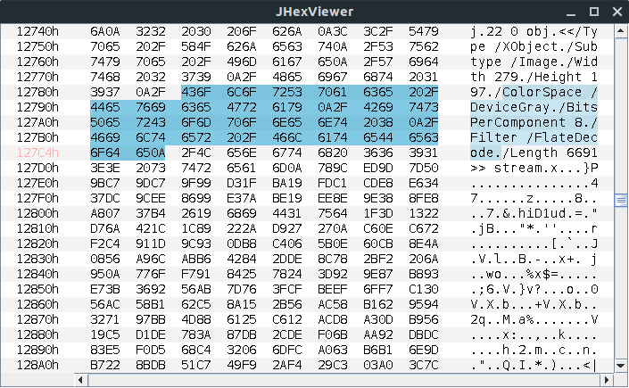
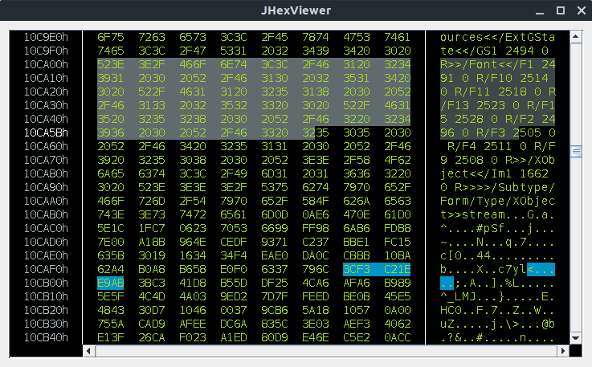

<p align="center">
    <a target="_blank" href="docs/images/JHexViewer-without-theme.png">
        
    </a>
    <a target="_blank" href="docs/images/JHexViewer-custom-theme.png">
        
    </a>
</P>


# What it is

JHexViewer is a basic hex viewer Swing component, which can be used to create more complex hex viewers based on it.

A lot of effort was put into making it customizable and easy to extend, instead of forcing you to stay with a fixed implementation. Nearly everything can be changed e.g. rendering of the content, Swing UI, layout of the rows etc.

It wasn't the goal to create a feature rich hex viewer as there are many existing tools out there. Instead I tried to focus on the core of a small hex viewer which builds the foundation for an easy to customize hex viewer.

**Main goals were:**

- to make it easy to customize and extend
- content is drawn using the Java 2D API to make it as customizable as possible
- complete exchangeable Swing UI
- write code that can be easily modified


# Features

- Instant opening regardless of file-size
  - currently only the first 50MB are displayed
- Drag'n'Drop to load files
- Context menus
- Styleable row layout
  - padding and spacing between bytes
  - byte grouping
    - display 1, 2, 4, 8 or 16 bytes as columns
- Styleable row rendering
  - use alternating background colors
  - render certain bytes in different colors to highlight them
- Styleable highlighter
  - use different highlighters to mark ranges of bytes
  - overwrite the selection highlighter
- Custom themes
- Custom Swing UI
- Many entry points to overwrite certain functionalities
  - painting of the areas (JHexViewer#setPaintRowsDelegate)
  - the caret (JHexViewer#setCaret)
  - the highlighter (JHexViewer#setHighlighter)
  - the scroll behavior (JHexViewer#setScrollableDelegate)
  - the row template factory (JHexViewer#.setRowTemplateFactory)
  - formatting of the displayed bytes or offset addresses (JHexViewer#setOffsetFormatter)
  - ...


# Controls
Files can be loaded by **drag and drop**.

- Action keys
	- caret actions
    	- to move the caret (`arrow keys`)
        - to start/expand a selection (`mouse` and `arrow keys`)
    - font actions
        - increase font size (`crtl + '+'`)
        - decrease font size (`crtl + '-'`)
    - switch focus between areas (`tab`)

# Build the project
Requires Maven and Java 8 or higher to build.

To build the maven project, run one of the following mvn commands from the command line. The command should be executed in the directory which contains the relevant `pom.xml` file.

Compile and run:
```
mvn -q compile exec:java
```

Compile and create executable jar file:
```
mvn -q compile assembly:single
```